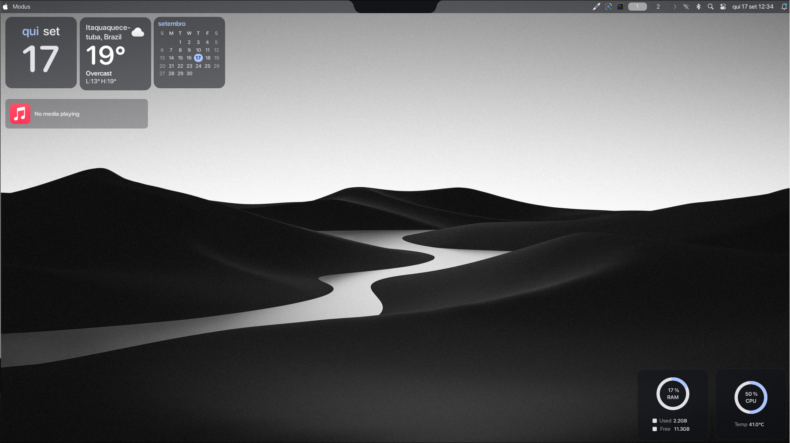

<div align="center">

# 🖥️ Crafix

**A macOS-style Hyprland desktop for Arch Linux — plus a classic Waybar setup, both one command away.**

[](LICENSE)
[](https://archlinux.org)
[](https://hyprland.org)
[](install.sh)

</div>

Crafix is a ready-to-use Hyprland configuration with two switchable looks:
a **classic Waybar** setup, and a **macOS-style shell** (top bar, dock,
spotlight search, traffic-light window buttons) built on
[Modus](https://github.com/S4NKALP/Modus). Clone it, run the installer, pick
a theme with `Super + T`.

<div align="center">

</div>

## ✨ Features

- 🎨 **Live theme switcher** (`Super + T`) — swap between the Waybar setup
  and the full Modus shell without logging out
- 🔴🟡🟢 **macOS-style window buttons** (close / hide / maximize) via the
  `hyprbars` Hyprland plugin
- 🖱️ **Mouse sensitivity + accel curve** GUI (`Super + =`) for mice with no
  Linux config tool
- 💡 **Monitor brightness over DDC/CI** (`XF86MonBrightness` keys) — for
  desktops with no laptop backlight
- 📸 **Windows-style area screenshot** (`Super + Shift + S`)
- 🎵 A **desktop music player widget**, matching Modus's clock/weather/RAM
  widgets and reusing its own MPRIS component
- ⌨️ Multi-monitor aware, including rotated/portrait displays
- 📦 Versioned package lists (`pacman` + AUR) so a fresh machine reaches
  parity in one command

## 🚀 Quick start

```bash
git clone https://github.com/pedrohkf/Arch-Linux.git crafix
cd crafix
./install.sh
```

The installer installs the package lists (`packages.txt`, `aur.txt` — needs
[`yay`](https://github.com/Jguer/yay) for the AUR ones) and copies every
`.config/` entry into place. It won't touch anything outside `~/.config`,
`~/.bashrc` and `~/.gitconfig`.

Then:

```bash
hyprctl reload
~/.config/hypr/theme-manager/theme-menu.sh   # or theme-switch.sh 0 / 1 directly
```

Theme `0-default` is plain Waybar and works immediately. Theme `1-macos` is
the Modus shell, which needs an extra one-time install — see
**[docs/hyprland-modus-setup.md](docs/hyprland-modus-setup.md)** for the
full walkthrough (prerequisites, `hyprpm`, monitor-specific gotchas).

> Before reloading, edit `~/.config/hypr/hardware.lua` — monitors, keyboard
> layout and mouse name are specific to the machine it was built on
> (`hyprctl devices` to find yours).

## 📁 Repository structure

```text
.
├── .config/
│   ├── hypr/                  # Hyprland (Lua config) + theme switcher + Modus patches
│   │   ├── themes/            # 0-default (Waybar) / 1-macos (Modus)
│   │   └── theme-manager/     # theme-menu.sh, theme-switch.sh
│   ├── modus-desktop-widgets/ # custom Modus desktop widgets (music player)
│   ├── waybar/
│   ├── kitty/
│   ├── wofi/
│   └── mimeapps.list
├── docs/
│   ├── hyprland-modus-setup.md  # full guide for the macOS-style setup
│   └── TODO.md                  # known issues / ideas
├── screenshots/
├── install.sh
├── packages.txt
├── aur.txt
└── README.md
```

## 📋 Requirements

- Arch Linux
- Hyprland with Lua config support (`/usr/include/hyprland/src/config/lua/`
  should exist — check `pacman -Qi hyprland`)
- `yay` or another AUR helper
- `hyprpm` (`sudo pacman -S hyprpm`) for the window-button plugin
- Optional: `ddcutil` for DDC/CI monitor brightness

## ⚠️ Notes

This repository intentionally excludes browser profiles, app caches,
Downloads, and anything else personal — only configuration files and
package lists are tracked. See [docs/TODO.md](docs/TODO.md) for known rough
edges (multi-monitor quirks, a couple of open bugs upstream).

## 🙏 Credits

Built on top of [Hyprland](https://hyprland.org), the
[hyprbars](https://github.com/hyprwm/hyprland-plugins) plugin, and
[Modus](https://github.com/S4NKALP/Modus) by S4NKALP.

## 📄 License

[MIT](LICENSE)
