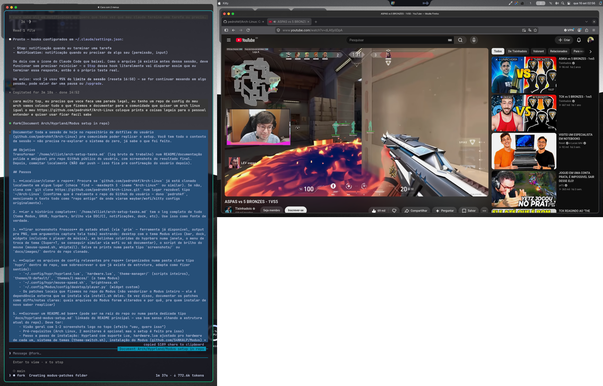
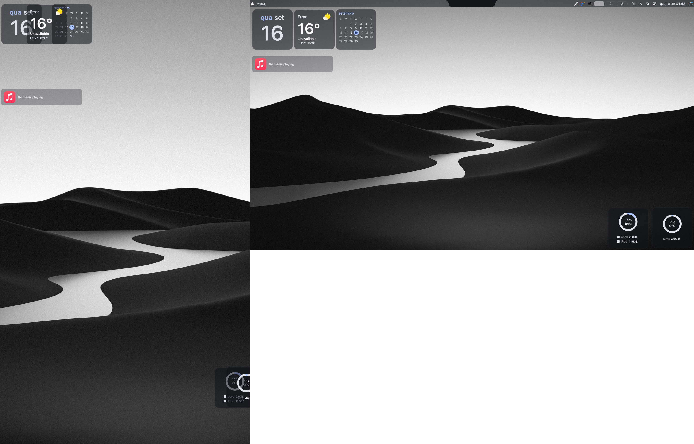

# Hyprland + Modus setup (macOS-style theme)

A second, newer desktop setup living alongside the classic Waybar config in
this repo: [Hyprland](https://hyprland.org) with **Lua config support**, a
small theme-switcher, and [Modus](https://github.com/S4NKALP/Modus) — a
full Python/Fabric shell that gives you a macOS-style top bar, dock, spotlight
search, lock screen and notification center.





Built and battle-tested on a desktop (no laptop backlight) with two external
monitors, one of them rotated to portrait. Everything below still works on a
single monitor / laptop — just skip the parts that don't apply.

## What you get

- **Theme switcher** (`Super + T`): pick between a plain Waybar setup and
  the full Modus shell, live, via `theme-switch.sh`
- **macOS-style window buttons** (red/yellow/green traffic lights, closes /
  hides / maximizes) via the `hyprbars` Hyprland plugin
- **Mouse sensitivity + accel curve** GUI (`Super + =`) for mice with no
  Linux config tool
- **Monitor brightness** over DDC/CI (the `XF86MonBrightness` keys) for
  desktops with no backlight, via `ddcutil`
- **Windows-style area screenshot** (`Super + Shift + S`)
- A **music player desktop widget**, same style as the clock/weather/RAM
  widgets, reusing Modus's own MPRIS player component

## Prerequisites

- Arch Linux, Hyprland with Lua config support (`/usr/include/hyprland/src/config/lua/`
  should exist — check `pacman -Qi hyprland`)
- `yay` or another AUR helper
- `hyprpm` (`sudo pacman -S hyprpm`) for the window-button plugin
- Optional: `ddcutil` for monitor brightness on a desktop; `git`, `curl`

## Install

### 1. Copy the config

```bash
cp -r .config/hypr ~/.config/
chmod +x ~/.config/hypr/*.sh ~/.config/hypr/theme-manager/*.sh
```

Edit `~/.config/hypr/hardware.lua` — monitors, keyboard layout, mouse name
(`hyprctl devices` to find yours) are all specific to this machine.

### 2. Reload and pick a theme

```bash
hyprctl reload
~/.config/hypr/theme-manager/theme-menu.sh   # wofi picker, or `theme-switch.sh 0`/`1` directly
```

Theme `0-default` is plain Waybar. Theme `1-macos` is Modus — which you need
to install separately first (next step) before switching to it, or the
switch will succeed but nothing will actually start.

### 3. Install Modus

Modus isn't vendored here — it's a real install with its own system
packages and a compiled C extension:

```bash
curl -fsSL https://raw.githubusercontent.com/S4NKALP/Modus/master/install.sh -o /tmp/modus-install.sh
bash /tmp/modus-install.sh
```

This needs `sudo` for ~43 packages via `yay`/`paru`, so run it in a real
terminal, not piped through anything non-interactive.

**Then apply the patches in [`../.config/hypr/modus-patches/`](../.config/hypr/modus-patches/README.md)**
— they fix real bugs in Modus around desktop hardware (no laptop backlight),
Brazilian keyboard layout, the lock screen, the dock's auto-hide, and long
notification text. Skip whichever don't apply to your hardware/layout.

### 4. Window buttons (hyprbars)

```bash
hyprpm add https://github.com/hyprwm/hyprland-plugins
hyprpm enable hyprbars
```

Both commands call `sudo` internally on first run (to pull matching
Hyprland headers) — run them in a real terminal too. The button
config/colors already live in `hardware.lua`, guarded so a missing plugin
doesn't break your whole config:

```lua
if hl.plugin.hyprbars then
    -- ...
end
```

### 5. Monitor brightness over DDC/CI (desktop only, skip on laptop)

```bash
sudo pacman -S ddcutil
sudo modprobe i2c-dev
echo "i2c-dev" | sudo tee /etc/modules-load.d/i2c-dev.conf
sudo groupadd -f i2c
sudo usermod -aG i2c $USER
echo 'KERNEL=="i2c-[0-9]*", GROUP="i2c", MODE="0660"' | sudo tee /etc/udev/rules.d/45-ddcutil-i2c.rules
sudo udevadm control --reload-rules && sudo udevadm trigger
```

**Log out and back in** for the new `i2c` group membership to apply — until
then `ddcutil`/`brightness.sh` need `sudo`. Run `ddcutil detect` to check
your monitors actually support DDC/CI (some need it turned on in their own
OSD menu — common on Samsung).

### 6. Desktop widgets

Modus auto-loads any `.py` file dropped into `~/.config/Modus/config/desktop/`
that calls `DesktopWidgetRegistry.register(...)` — no core files touched.
The music player widget in this repo is one example:

```bash
mkdir -p ~/.config/Modus/config/desktop
cp .config/modus-desktop-widgets/player.py ~/.config/Modus/config/desktop/
```

## Keyboard shortcuts

| Key | Action |
|---|---|
| `Super + T` | Theme picker (wofi) |
| `Super + =` | Mouse sensitivity GUI (`whiptail`) |
| `Super + Shift + S` | Area screenshot to clipboard (like Windows' Snipping Tool) |
| `Print` | Same as above |
| **Modus theme only** | |
| `Super + D` | Spotlight (app search) |
| `Super + E` | Emoji picker |
| `Super + V` | Clipboard history |
| `Super + W` | Wallpaper picker |
| `Super + Shift + W` (`Alt+Shift+W`) | Random wallpaper |
| `Super + I` | Settings |
| `Super + Ctrl + L` | Lock screen |
| `Alt + Tab` | App switcher |
| `Alt + Shift + R` | Restart Modus |
| `Super + Alt + S` / `Super + Alt + Shift + S` | Scratchpad toggle / move window there (moved off `Super+S` to avoid clashing with Modus's own screenshot bind) |
| `XF86MonBrightnessUp/Down` | Brightness (DDC/CI) |

## Gotchas found the hard way

These cost real debugging time — save yourself the trouble:

- **`hl.on("hyprland.start", ...)` only fires on a real compositor boot, never
  on `hyprctl reload`.** Any script that switches themes/configs live (like
  `theme-switch.sh`) can't rely on autostart hooks to (re)launch anything —
  it has to start every process explicitly itself, every time.

- **The classic `hyprctl dispatch <name> <args>` CLI syntax doesn't work**
  on a Lua-config Hyprland build. `hyprctl dispatch killactive` errors out.
  Use the Lua call as a quoted string instead:
  `hyprctl dispatch "hl.dsp.window.close()"`. This bit the `hyprbars`
  button actions specifically — `hyprctl dispatch fullscreen 1` silently
  did nothing.

- **A systemd user service with D-Bus activation comes back even after
  `pkill` + disabling it.** `swaync` (a leftover notification daemon from
  an earlier theme) kept re-stealing the `org.freedesktop.Notifications`
  D-Bus name from Modus every time a notification was sent, because
  systemd auto-starts it via D-Bus activation regardless of its boot
  enable/disable state. Fix: `systemctl --user mask swaync.service` — only
  `mask` blocks D-Bus activation; `disable` doesn't.

- **Orphaned processes from a previous theme can survive indefinitely** if
  the switch script only kills processes by name and misses supervisor
  loops (`while true; do waybar; sleep 3; done`) or systemd-managed
  services. `theme-switch.sh` here explicitly kills waybar, the dock, and
  Modus before every switch for exactly this reason.

## Known issues / what's left

See **[TODO.md](TODO.md)** — pending items (a monitor that won't do DDC/CI,
a notification panel rendering bug, unfinished Secure Boot) and ideas for
later.

## Credits

- [Modus](https://github.com/S4NKALP/Modus) by S4NKALP — the shell itself
- [hyprbars](https://github.com/hyprwm/hyprland-plugins) by hyprwm — window
  buttons
- The original theme this setup replaced was adapted from
  [AvilaCarlosDev/hyprland-macos-dotfiles](https://github.com/AvilaCarlosDev/hyprland-macos-dotfiles) —
  kept for reference in `.config/hypr/theme-manager/archived-themes/`
